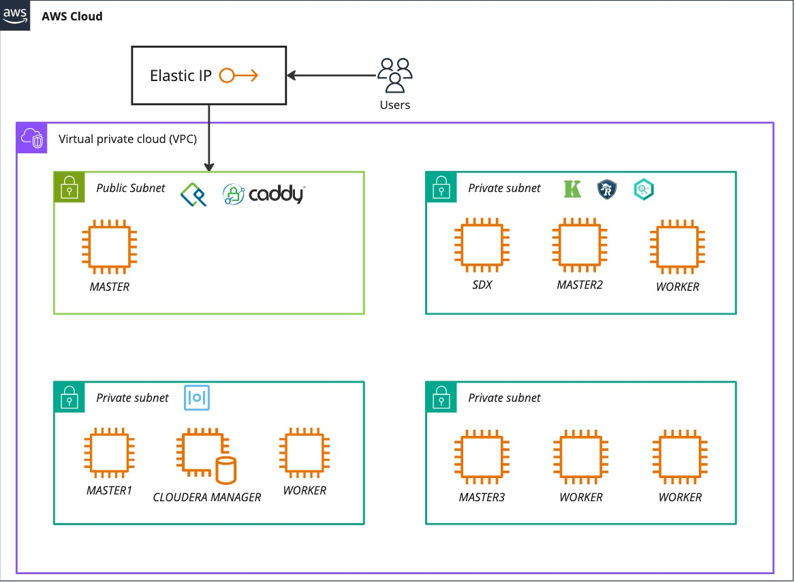

<!-- Copyright 2026 Cloudera, Inc.

     Licensed under the Apache License, Version 2.0 (the "License");
     you may not use this file except in compliance with the License.
     You may obtain a copy of the License at

         https://www.apache.org/licenses/LICENSE-2.0

     Unless required by applicable law or agreed to in writing, software
     distributed under the License is distributed on an "AS IS" BASIS,
     WITHOUT WARRANTIES OR CONDITIONS OF ANY KIND, either express or implied.
     See the License for the specific language governing permissions and
     limitations under the License. -->

# Cloudera On Premise Community Edition

This project provides Ansible + Terraform automation for deploying Cloudera Private Cloud on AWS infrastructure. It constructs a ring-fenced, 10-node cluster accessible only via SSH and reverse HTTPS proxies.

## What's Included

- Self-contained DNS, Kerberos, database, and TLS services
- ACME-managed TLS termination on the reverse proxy
- Cloudera Manager Server and agents installed and configured
- Kerberos and Auto-TLS configuration
- Multiple cluster topology options:
    - Ozone-enabled base cluster
    - Kafka cluster
    - Flink cluster
    - NiFi (CFM) cluster
    - NiFi 2.0 cluster
    - CSA (Cloudera Streaming Analytics) full cluster
    - ECS (Experience Cluster Services) with Data Services

## Architecture Overview



## Design Principles

- **Modular** — each stage (infrastructure, services, CM, cluster) runs independently
- **Idempotent** — playbooks can be run repeatedly with no unintended changes
- **Adaptable** — override any default via `config.yml`; swap infrastructure providers by replacing Terraform modules

!!! note
    This project targets AWS IaaS. Converting to Azure, GCP, or static inventory is straightforward — see [Architecture](reference/README.md) for details.

!!! tip
    This project is an **example** of how to construct Day 1 and Day 2 automation. The real advantage is using the underlying Cloudera automation collections.

## Quick Start

Clone the project to your workspace:

```bash
git clone https://<YOUR_GIT_HOST>/<YOUR_REPO_NAME>.git
cd <YOUR_REPO_NAME_ONLY>
```


Run all deployment playbooks

```bash
ansible-navigator run playbooks/infrastructure.yml playbooks/services.yml playbooks/cms.yml playbooks/ozone-cluster.yml -e @config.yml
```

The full deployment takes approximately 40–50 minutes. See [Deployment Overview](deployment/README.md) for details.
