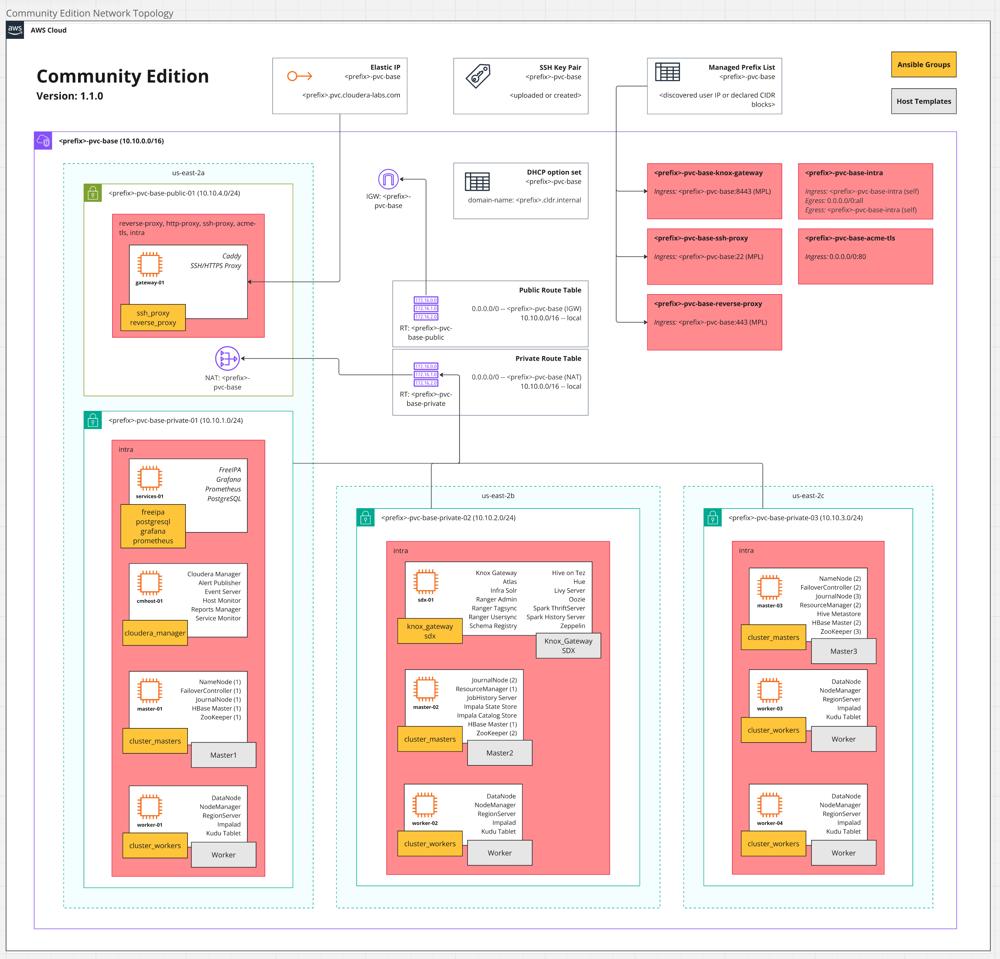

<!-- Copyright 2026 Cloudera, Inc.

     Licensed under the Apache License, Version 2.0 (the "License");
     you may not use this file except in compliance with the License.
     You may obtain a copy of the License at

         https://www.apache.org/licenses/LICENSE-2.0

     Unless required by applicable law or agreed to in writing, software
     distributed under the License is distributed on an "AS IS" BASIS,
     WITHOUT WARRANTIES OR CONDITIONS OF ANY KIND, either express or implied.
     See the License for the specific language governing permissions and
     limitations under the License. -->

# Architecture

## AWS Infrastructure

The deployment creates a ring-fenced VPC with public and private subnets:



```
┌─────────────────────────────────────────────────────────────────┐
│ VPC (10.10.0.0/16)                                              │
│                                                                 │
│  ┌──────────────────┐    ┌────────────────────────────────────┐ │
│  │  Public Subnet   │    │  Private Subnet                    │ │
│  │                  │    │                                    │ │
│  │  ┌────────────┐  │    │  ┌─────────┐  ┌────────────────┐  │ │
│  │  │  Gateway   │◄─┼────┼──│Services │  │ Masters (x3)   │  │ │
│  │  │  (Caddy)   │  │    │  │FreeIPA  │  │ Workers (x4)   │  │ │
│  │  │  EIP       │  │    │  │Postgres │  │ CMS            │  │ │
│  │  └────────────┘  │    │  │pgAdmin  │  │ SDX/Knox       │  │ │
│  │                  │    │  └─────────┘  └────────────────┘  │ │
│  └──────────────────┘    └────────────────────────────────────┘ │
│                                                                 │
└─────────────────────────────────────────────────────────────────┘
```

- **Gateway** — only host with a public IP (Elastic IP); runs Caddy reverse proxy and SSH jump host
- **Services** — FreeIPA (DNS + Kerberos + CA), PostgreSQL, pgAdmin, optionally Prometheus/Grafana
- **Cluster hosts** — accessible only via the gateway proxy

## Ansible Inventory Groups

```yaml
deployment:
  cluster:
    base:
      base_masters:    # Master1, Master2, Master3
      base_workers:    # Worker nodes
      sdx:             # SDX + Knox Gateway
      knox_gateway:    # (same hosts as sdx)
    ecs:               # (empty for base topology)
      ecs_masters:
      ecs_workers:
  cloudera_manager:    # CM Server host

proxied_servers:       # All internal hosts (SSH via jump proxy)
  deployment:
  freeipa:
  postgresql:
  pgadmin:

reverse_proxy:         # Gateway (Caddy)
ssh_proxy:             # Gateway (SSH jump)
```

## Network Access

| Source | Destination | Protocol | Purpose |
|--------|-------------|----------|---------|
| Internet (ingress CIDR) | Gateway:22 | SSH | Jump host access |
| Internet (ingress CIDR) | Gateway:443 | HTTPS | Reverse proxy |
| Internet (ingress CIDR) | Gateway:8443 | HTTPS | Knox Gateway |
| All cluster hosts | All cluster hosts | All | Intra-cluster communication |
| Gateway | Internet | All | Outbound (package downloads, ACME) |

## Alternative Inventories

To deploy on a different cloud provider (GCP, Azure, Equinix) or static infrastructure, you need to:

1. Replace the Terraform modules in `tf_cluster_aws/` with your provider's equivalent
2. Ensure your provisioning tool produces an Ansible inventory matching the group hierarchy in `inventory-template.yml`

The playbooks (services, CMS, clusters) are cloud-agnostic — they only require the correct inventory group structure.

!!! tip
    Static inventory works too. Define hosts in a YAML inventory file matching the structure in `inventory-template.yml`, and skip the `infrastructure.yml` playbook entirely.
